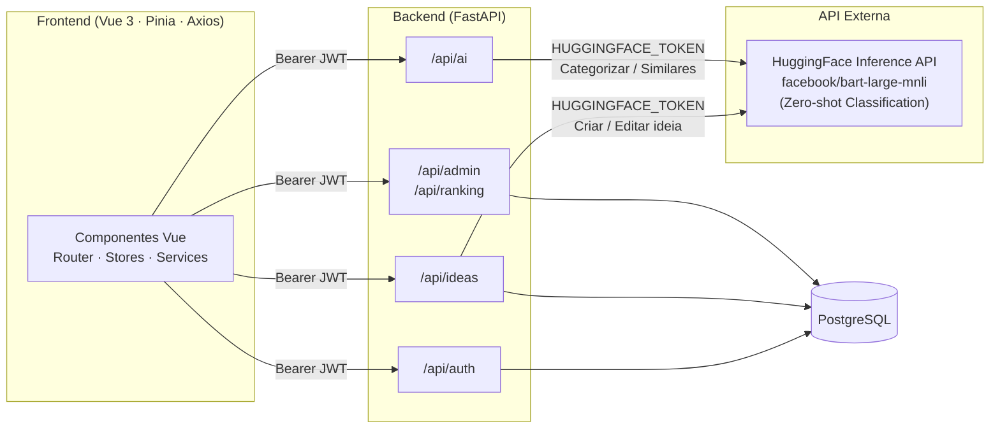
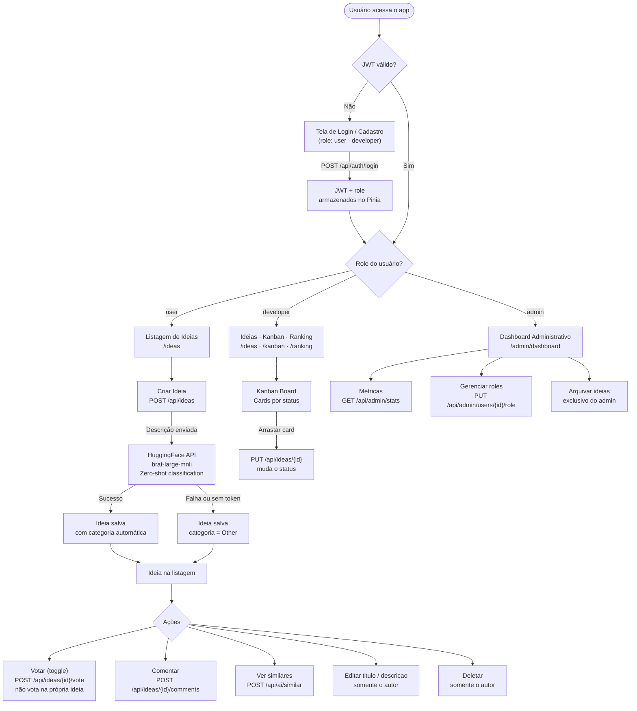
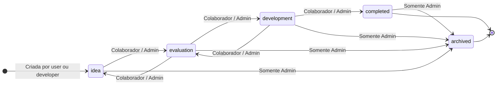

# AI Innovation Hub — Frontend

Interface construída com **Vue 3** (Composition API), **TypeScript**, **Tailwind CSS** e **Pinia**.

---

## Fluxo da Aplicação

### Arquitetura



---

### Fluxo principal



---

### Ciclo de vida de uma ideia



> Ideias nos estados `completed` e `archived` nao aceitam votos nem edicao de conteudo.
> Apenas o **admin** pode arquivar. Apenas o **autor** pode deletar ou editar conteudo.

---

## Executar com Docker (recomendado)

```bash
# 1. Configure as variáveis de ambiente
cp .env.example .env
# O padrão já funciona para uso local com Docker

# 2. Build e start
docker compose up --build -d

# Frontend disponível em: http://localhost:3000
```

> **Pré-requisito:** o backend deve estar rodando em `localhost:8000`.

---

## Executar localmente (sem Docker)

```bash
# Instalar dependências
npm install

# Iniciar servidor de desenvolvimento
npm run dev

# App disponível em: http://localhost:5173
```

Em modo dev, o Vite faz proxy automático de `/api/*` para `http://localhost:8000`.

---

## Variáveis de ambiente

| Variável | Descrição | Quando usar |
|----------|-----------|-------------|
| `BACKEND_URL` | URL do backend usada pelo **nginx** | Apenas com `docker compose up` |
| `VITE_API_URL` | URL da API usada pelo **Vite proxy** | Apenas com `npm run dev` |

> `BACKEND_URL` é substituída no nginx via `envsubst` sem necessidade de rebuild.

---

## Testes

```bash
npx vitest run    # execução única
npx vitest        # modo watch
```

---

## Estrutura de pastas

```
src/
├── assets/             # CSS global (Tailwind base)
├── components/
│   ├── auth/           # LoginForm, RegisterForm
│   ├── common/         # Pagination, SearchBar, StatusBadge
│   ├── dashboard/      # MetricsCards, IdeasTable, UserManagement
│   ├── ideas/          # IdeaCard, IdeaForm, IdeaFilters, IdeaBoard, KanbanColumn
│   │                   # VoteButton, CollaboratorSection, CommentSection
│   ├── layout/         # AppLayout, AppHeader, AppSidebar
│   └── ranking/        # PodiumSection, RankingTable
├── composables/        # useToast
├── config/             # navigation.ts — sidebar por role
├── router/             # Vue Router com guards de autenticação e role
├── services/           # api.ts (Axios + JWT), authService, ideaService,
│                       # collaborationService, aiService, adminService, rankingService
├── stores/             # Pinia: auth, ideas, collaboration, admin, ranking
├── types/              # Interfaces TypeScript globais
└── views/              # Páginas por role
```

---

## Navegação por role

| Role | Sidebar | Rota inicial |
|------|---------|--------------|
| **user** | Ideias, Minhas Ideias | `/ideas` |
| **developer** | Ideias, Minhas Ideias, Kanban, Ranking | `/ideas` |
| **admin** | Dashboard, Ideias, Usuários, Ranking | `/admin/dashboard` |

> **Admin** não pode ser criado pelo formulário de cadastro. Veja o [README do Backend](../backend/README.md).

---

## Decisões técnicas

| Decisão | Escolha | Motivo |
|---------|---------|--------|
| Framework | Vue 3 Composition API | Melhor TypeScript, reatividade granular |
| Estado | Pinia | Simples, tipado, compatível com DevTools |
| Estilo | Tailwind CSS | Utilitário, sem CSS custom, design system consistente |
| HTTP | Axios + interceptors | JWT automático, handler global de 401 |
| Build | Vite | HMR rápido, proxy de dev integrado |
| Drag & drop | vuedraggable | Wrapper do SortableJS; controle por card |
| Router | Vue Router 4 com guards | Proteção declarativa via meta.roles |
| Nginx | Template + envsubst | BACKEND_URL configurável sem rebuild |
